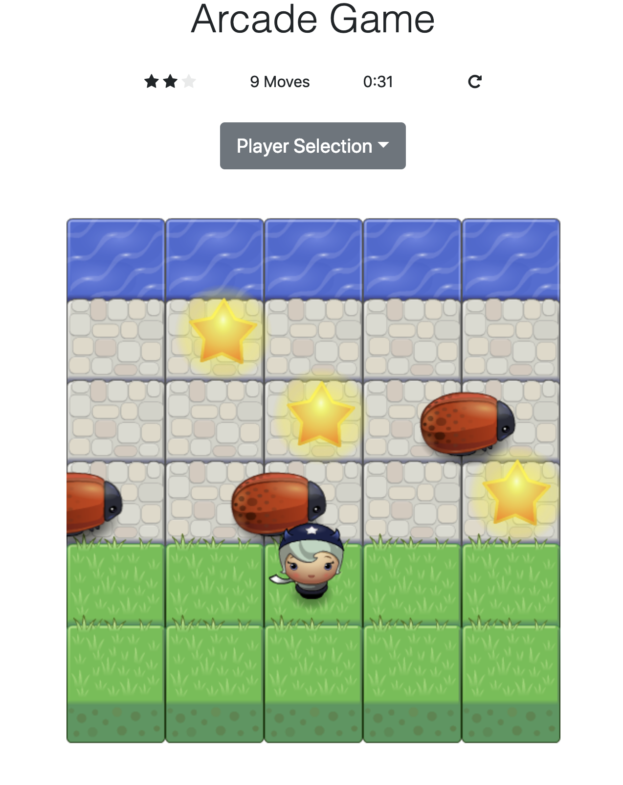

# Arcade Game

In this game you have a Player and Enemies (bugs). The goal of the player is to reach the water, without colliding into any one of the enemies. To play the game open `index.html` in your browser.

## How To Play
* Select your choice of Player from 5 available characters from `Player Selection` dropdown
* The player can move left, right, up and down using the standard directional keys on the keyboard
* The enemies move at varying speeds on the paved block portion of the game board
* Once the player collides with an enemy, the game is reset and the player moves back to the starting square
* Once the player reaches the water (i.e., the top of the game board), the game is won

## Score-Panel
The Score-Panel displays star rating, moves and time taken. Try reaching the water with at most 7 moves to get 3 stars! :)

## Technology Used
The game is developed using HTML, CSS, JavaScript. The game uses `bootstrap`, `font-awesome` and its responsive design is fit for all modern desktop, tablet, and phone browsers.

Have Fun!

